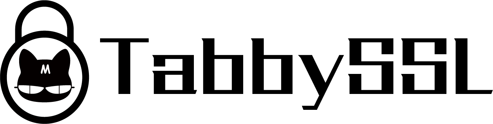

<p align="center"></p>
<h1 align="center">OpenSSL compatibility layer for the Rust SSL/TLS stack</h1>

Previously [MesaLink](https://github.com/mesalock-linux/mesalink), **TabbySSL**
is an OpenSSL compatibility layer for the Rust SSL/TLS stack.

## Supported ciphersuites
> Same as rustls

* TLS13-CHACHA20-POLY1305-SHA256
* TLS13-AES-256-GCM-SHA384
* TLS13-AES-128-GCM_SHA256
* TLS-ECDHE-ECDSA-WITH-CHACHA20-POLY1305-SHA256
* TLS-ECDHE-RSA-WITH-CHACHA20-POLY1305-SHA256
* TLS-ECDHE-ECDSA-WITH-AES-256-GCM-SHA384
* TLS-ECDHE-ECDSA-WITH-AES-128-GCM-SHA256
* TLS-ECDHE-RSA-WITH-AES-256-GCM-SHA384
* TLS-ECDHE-RSA-WITH-AES-128-GCM-SHA256

## Building instructions

Bazel is the only supported build system for TabbySSL.

```
$ git clone https://github.com/ymjing/tabbyssl.git
$ cd tabbyssl
$ bazel build :tabbyssl
```

## Running examples

```
$ bazel run :example_simple_client_c google.com
```

## Running integration tests

```
$ bazel run :tabbyssl_test
```

## Maintainer

 * Yiming Jing `<yjing@apache.org>` [@ymjing](https://github.com/ymjing)

## License
TabbySSL is provided under the Apache License version 2.0. For a copy, see the
LICENSE file.

# Code of conduct

This project adopts the [Rust Code of
Conduct](https://www.rust-lang.org/policies/code-of-conduct). Please email
rustls-mod@googlegroups.com to report any instance of misconduct, or if you have
any comments or questions on the Code of Conduct.